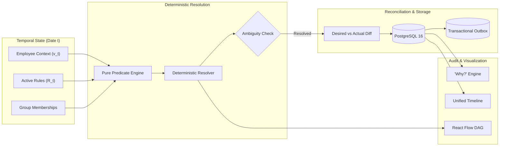
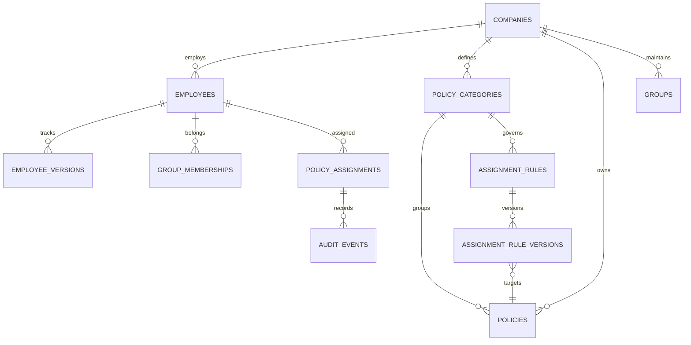

# Warp Policy Assignment System

> **Production-grade, temporally-aware, deterministic policy resolution and convergence engine.**
> Built with Node.js, TypeScript, PostgreSQL 16, Drizzle ORM, Express, React 19, React Flow, and Tailwind CSS.

---

## Table of Contents
1. [Executive Summary & Architectural Pillars](#executive-summary--architectural-pillars)
2. [Domain Model & Entity Relationships](#domain-model--entity-relationships)
3. [Temporal Semantics & Interval Math](#temporal-semantics--interval-math)
4. [Deterministic Resolver & Ambiguity Detection](#deterministic-resolver--ambiguity-detection)
5. [Reconciliation Engine & Atomic Convergence](#reconciliation-engine--atomic-convergence)
6. [Transactional Outbox & Scoped Incremental Reconciler](#transactional-outbox--scoped-incremental-reconciler)
7. [Audit System & "Why?" Explainability Engine](#audit-system--why-explainability-engine)
8. [React Flow Dynamic Resolution DAG & Web UI](#react-flow-dynamic-resolution-dag--web-ui)
9. [Property-Based Testing & Mathematical Invariants](#property-based-testing--mathematical-invariants)
10. [Acme Corporation Live Demo Scenario](#acme-corporation-live-demo-scenario)
11. [Quickstart & Getting Started](#quickstart--getting-started)

---

## Executive Summary & Architectural Pillars

The Warp Policy Assignment System is designed from foundational principles for enterprise payroll and HR policy governance. It guarantees:

- **P1: Mathematical Correctness**: Resolution is a pure mathematical function of $(E_t, R_t, t)$ with zero side effects.
- **P2: Deterministic Ordering**: Evaluation order is strictly invariant under any input permutation (`priority DESC`, `ruleId ASC`).
- **P3: Explicit Half-Open Temporal Windows**: Validity is represented as $[\text{effectiveFrom}, \text{effectiveTo})$, preventing interval boundary gaps and overlaps.
- **P4: Strictly Idempotent Reconciliation**: Running reconciliation on converged state produces 0 additions, 0 revocations, and 0 database writes.
- **P5: Scoped Incremental Recomputation**: Predicates are indexed by employee fields, group IDs, and tenure milestones to recompute only affected categories.
- **P6: Total Auditability & "Why?" Explainability**: Every historical assignment links to a frozen decision snapshot with plain-language reasoning.



---

## Domain Model & Entity Relationships



### Key Schemas
- **`employees` & `employee_versions`**: Atomic valid-time tracking for department, employment type, location, and manager status.
- **`policy_categories`**: Declares cardinality constraints (`ONE` vs `MANY`).
- **`assignment_rules` & `assignment_rule_versions`**: Draft $\to$ Published rule versioning with AST predicate JSON payloads.
- **`policy_assignments`**: Materialized assignments with `explanation_snapshot` JSONB and $[ \text{effectiveFrom}, \text{effectiveTo} )$ timestamps.
- **`outbox_events`**: Transactional domain event log ensuring at-least-once delivery for asynchronous triggers.
- **`temporal_jobs`**: Future milestone execution ledger for scheduled promotions (e.g. 24-month tenure promotion).

---

## Temporal Semantics & Interval Math

Validity intervals follow half-open semantics $[ \text{effectiveFrom}, \text{effectiveTo} )$:
1. **Active Condition**: An assignment is active at date $t$ if and only if:
   $$\text{effectiveFrom} \le t < \text{effectiveTo} \quad (\text{or } \text{effectiveTo is NULL})$$
2. **Cardinality `ONE` Non-Overlap**: For any category with cardinality `ONE`, no two active assignments can overlap:
   $$\forall a_1, a_2 \in \text{Assignments}(E, C), \quad [a_1.\text{from}, a_1.\text{to}) \cap [a_2.\text{from}, a_2.\text{to}) = \emptyset$$
3. **Inclusive Tenure Calculation**: Tenure months are calculated with inclusive calendar-day math:
   $$\text{Tenure}(E, t) = (\text{Year}(t) - \text{Year}(h)) \times 12 + (\text{Month}(t) - \text{Month}(h)) + (\text{Day}(t) \ge \text{Day}(h) ? 0 : -1)$$

---

## Deterministic Resolver & Ambiguity Detection

When resolving rules for category $C$ at date $t$:
1. Filter active rule versions where $\text{validFrom} \le t < \text{validTo}$.
2. Evaluate AST predicates against employee attributes and group memberships.
3. For **`ONE` Categories**:
   - Order matching rules by `priority DESC`, then `ruleId ASC`.
   - If multiple matching rules share the top priority but assign **distinct policies**, the resolver marks the category as `status: "AMBIGUOUS"` and assigns zero policies.
   - If multiple rules share top priority and assign the **same policy**, deduplicate and assign the policy deterministically.
4. For **`MANY` Categories**:
   - Assign all matching distinct policies.

---

## Reconciliation Engine & Atomic Convergence

Reconciliation is a pure 3-phase convergent transaction:
1. **Preview / Diff Calculation**: Computes `toAdd`, `toRevoke`, `toUpdate`, and `unchanged`.
2. **Atomic Convergence**:
   - Closes existing assignments by setting $\text{effectiveTo} = t$.
   - Inserts new assignments starting at $\text{effectiveFrom} = t$ with an attached `explanationSnapshot`.
   - Records `POLICY_ASSIGNED` and `POLICY_REVOKED` in `audit_events`.
3. **Idempotency Guarantee**: Running reconciliation twice on date $t$ yields $\Delta = \emptyset$.

---

## Transactional Outbox & Scoped Incremental Reconciler

1. **Transactional Outbox**:
   - Attribute mutations (e.g. employee relocation) atomically write to `outbox_events` within the same PostgreSQL transaction.
2. **In-Memory AST Dependency Index**:
   - Maps employee fields (`state`, `country`, `department`, `employmentType`, `isManager`), group IDs, and tenure dependencies to affected policy categories.
3. **Scoped Recomputation**:
   - Relocating an employee from NY to CA re-evaluates only `Vacation` and `Workplace Training` categories, bypassing all unaffected categories.

---

## Audit System & "Why?" Explainability Engine

Answers the fundamental question:
> *"Why does employee $E$ have or not have policy $P$ at date $t$?"*

### Explainability Statuses:
- **`ASSIGNED` (Winner)**: Matched rule won priority ranking.
- **`OVERRIDDEN`**: Matched rule criteria, but superseded by a higher priority rule.
- **`NO_MATCH`**: Failed one or more predicate conditions (returns full failed condition trail).
- **`AMBIGUOUS`**: Tied at highest priority with a conflicting policy.

---

## React Flow Dynamic Resolution DAG & Web UI

The web interface is built with React 19, React Flow (`@xyflow/react`), and Tailwind CSS:
- ⚡ **Resolution DAG Explorer**: Interactive node graph visualizing employee context $\to$ category evaluation $\to$ policy assignment outputs.
- 👥 **Employees & Timeline**: Point-in-time assignment matrix, profile versioning, and unified chronological audit timeline.
- 📜 **Rules Matrix**: AST rule inspector, priority ordering, and draft-to-publish workflow.
- 🔄 **Reconciliation Center**: Live point-in-time diff simulation, company-wide convergence, and background worker queue runner.
- 🔍 **Audit & "Why?" Playground**: Instant plain-language explainability inspector.

---

## Property-Based Testing & Mathematical Invariants

Tested with `fast-check` over hundreds of randomized configurations:
1. **Determinism**: 100% rule-order permutation invariance.
2. **Cardinality**: `ONE` category never exceeds 1 assignment.
3. **Priority Invariant**: Selected policy always matches the maximal candidate priority.
4. **Reference Resolver Equivalence**: Optimized resolver matches unoptimized reference model bit-for-bit.
5. **Reconciliation Idempotency**: Second pass on converged state strictly produces 0 mutations.

---

## Acme Corporation Live Demo Scenario

| Employee | Hire Date | Scenario / Attributes | Resolved Policies (At Hire) |
|---|---|---|---|
| **Sarah Chen** | 2024-08-28 | Engineering, Full-time, California, Manager | CA Vacation (Priority 50), Engineering Equipment, Health, Remote Work, Manager Training |
| **Alex Morgan** | 2024-08-28 | Sales, Full-time, New York | Standard Vacation (Priority 10), Standard Equipment, Health, Sales Training |
| **Jordan Lee** | 2024-08-28 | HR, Contractor, Ontario (Canada) | Standard Equipment, Contractor Remote Stipend |
| **Taylor Swift** | 2024-08-28 | Legal, Full-time, UK | Standard Vacation, Standard Equipment, Health |

---

## Quickstart & Getting Started

### 1. Prerequisites
- Node.js $\ge 20$
- PostgreSQL 16 (Running on port 5433 or configured via `.env`)

### 2. Environment Setup
```bash
cp .env.example .env
npm install
```

### 3. Database Migration & Seed
```bash
npm run db:push
npm run db:seed
```

### 4. Run Test Suite
```bash
# Run all 13 test suites (114 tests)
npx vitest run
```

### 5. Start Development Servers
```bash
# Starts Express API (port 3001) and Vite React SPA (port 3000)
npm run dev
```

Visit **`http://localhost:3000`** in your browser.
