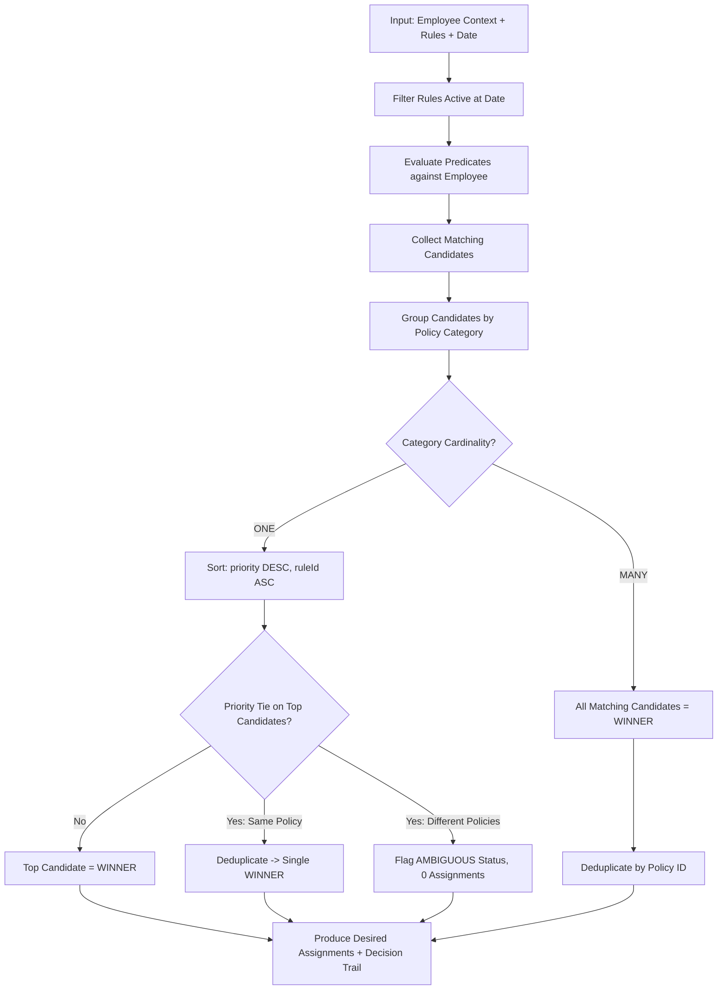

# Resolution Subsystem

## Overview

The resolution engine is the pure mathematical core of the Policy Assignment System. It answers the fundamental question:

> **"Given an employee's attributes, a company's active versioned rules, and a specific point in time $t$, what policies should this employee have?"**

---

## Non-Negotiable Semantic Principles

1. **P2 — Pure and Deterministic:**
   The resolver is a pure function. Given identical `(employeeContext, rules, atDate)`, it produces the exact same assignments and decision trail regardless of rule evaluation order, database retrieval order, or memory layout.
2. **P6 — Explicit Temporal Validity:**
   Business-effective dates are half-open intervals `[effectiveFrom, effectiveTo)`. The resolver always requires an explicit `at: Date | string` parameter and never implicitly defaults to "now" internally.
3. **P8 — Explainability from Resolution:**
   The decision trail (candidates, winners, overridden rules, tied conflicts) is produced directly during resolution. There is no secondary explanation approximation algorithm.

---

## Core Signature

```typescript
function resolve(
  employee: EmployeeContext,
  rules: EvaluatableRule[],
  at: string | Date
): ResolutionResult
```

### Input Context

- `EmployeeContext`:
  ```typescript
  interface EmployeeContext {
    id: EmployeeId;
    companyId: CompanyId;
    country: string;
    state: string | null;
    department: string;
    employmentType: EmploymentType;
    isManager: boolean;
    hireDate: string; // ISO date
    groupIds: GroupId[];
  }
  ```
- `EvaluatableRule`:
  ```typescript
  interface EvaluatableRule {
    ruleId: AssignmentRuleId;
    ruleVersionId: AssignmentRuleVersionId;
    version: number;
    policyId: PolicyId;
    policyName: string;
    categoryId: PolicyCategoryId;
    categoryKey: string;
    categoryName: string;
    cardinality: "ONE" | "MANY";
    predicate: Predicate;
    priority: number;
    effectiveFrom: string; // ISO date
    effectiveTo: string | null; // ISO date, null = no expiration
  }
  ```

---

## Resolution Algorithm



### Step-by-Step Execution:

1. **Temporal Filtering:**
   Keep only rules where:
   $$\text{effectiveFrom} \le \text{at} < \text{effectiveTo}$$
   *(If `effectiveTo` is null, the upper bound is unbounded).*

2. **Predicate Evaluation:**
   Evaluate each active rule's predicate AST against the employee context at date `at`.

3. **Category Grouping:**
   Group all matching candidates by `categoryId`.

4. **Cardinality Resolution:**
   - **`ONE` Cardinality (e.g., Vacation, Pay Schedule, Healthcare):**
     - Sort candidates by: `priority DESC`, then `ruleId ASC`.
     - If the highest priority candidate is unique: mark as `WINNER`, other candidates as `OVERRIDDEN`.
     - If top candidates have equal priority and point to the **same** `policyId`: deduplicate to a single `WINNER`.
     - If top candidates have equal priority and point to **different** `policyId`s: flag category as `status: "AMBIGUOUS"`. **Never arbitrarily choose a winner.** No assignment is emitted for ambiguous categories until the conflict is resolved by an administrator.
   - **`MANY` Cardinality (e.g., Application Access, Compliance Training, Stipends):**
     - All matching rules are `WINNER`.
     - Desired assignments are deduplicated by `policyId` so an employee never receives duplicate copies of the same policy.

5. **Output Generation:**
   Returns `ResolutionResult`:
   - `assignments: DesiredAssignment[]`
   - `decisions: Decision[]` (complete audit and explanation trail)

---

## Tenure Computation Semantics (§16)

Tenure is calculated inclusively as completed months between `hireDate` and `evaluationDate`:

$$\text{tenureMonths} = (\text{year}_{\text{eval}} - \text{year}_{\text{hire}}) \times 12 + (\text{month}_{\text{eval}} - \text{month}_{\text{hire}})$$
*(decremented by 1 if $\text{day}_{\text{eval}} < \text{day}_{\text{hire}}$).*

### Concrete Sarah Chen Example:
- `hireDate = 2024-08-28`
- `evaluationDate = 2026-08-27` $\rightarrow$ 23 months $\rightarrow$ `TENURE_AT_LEAST(24)` is **false**
- `evaluationDate = 2026-08-28` $\rightarrow$ 24 months $\rightarrow$ `TENURE_AT_LEAST(24)` is **true** $\rightarrow$ Extended Vacation (priority 60) activates and supersedes California Vacation (priority 50).

---

## Reference Resolver (§38, §39)

The `referenceResolver` is a deliberately minimal, unoptimized implementation of the resolution specification. It processes all rules without database indexes or dependency filtering, serving as the formal ground truth for verifying incremental reconciliation in Phase 9.
